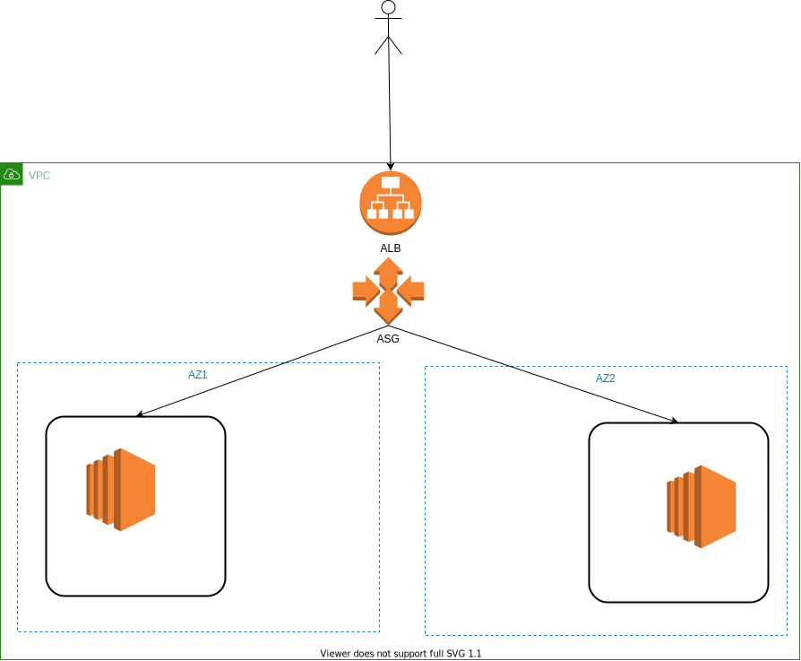

**Create DB Cluster Parameter Group and DB Parameter Group**
```shell
aws cloudformation create-stack --stack-name wordpress-parameter-group \
  --template-body file://parameter-group.yml \
  --parameters \
  ParameterKey=StageName,ParameterValue=dev \
  ParameterKey=ApplicationName,ParameterValue=wordpress \
  --region us-east-2
```

**Create DB Cluster and Instance**
```shell 
aws cloudformation create-stack --stack-name wordpress-rds \
  --template-body file://rds-instance.yml \
  --parameters \
  ParameterKey=StageName,ParameterValue=dev \
  ParameterKey=AuroraMasterUsernameParameter,ParameterValue=admin \
  ParameterKey=AuroraMasterUserPasswordParameter,ParameterValue=adminadmin \
  --region us-east-2
```

**Create ASG**
```shell 
aws cloudformation create-stack --stack-name ec2-asg \
  --template-body file://asg.yml \
  --parameters \
  ParameterKey=StageName,ParameterValue=dev \
  ParameterKey=ApplicationName,ParameterValue=wordpress \
  --region us-east-2
```
